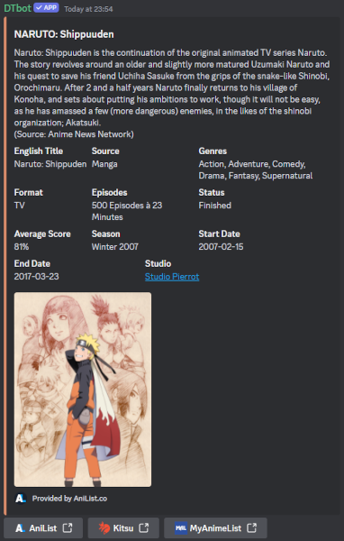
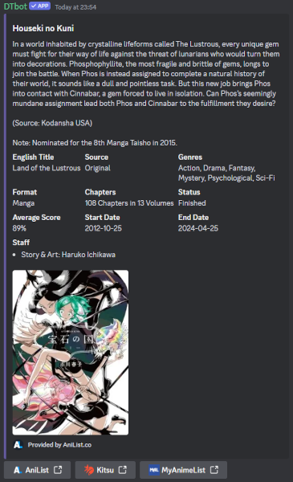

# DTbot Command Overview

This document provides an overview of the commands available in DTbot, as well as some examples of how to use them.

Currently, DTbot offers over 60 commands.

## Table of Contents

- [Conversion Commands](#conversion-commands)
    - [Temperature](#temperature)
    - [Length](#length)
    - [Weight](#weight)
    - [Volume](#volume)
- [Interaction Commands](#interaction-commands)
    - [Interactions with Users](#interactions-with-users)
    - [Interactions with Reasons](#interactions-with-reasons)
    - [Other Interaction Commands](#other-interaction-commands)
- [Maths Commands](#maths-commands)
- [Randomness Commands](#randomness-commands)
    - [General Randomness Commands](#general-randomness-commands)
    - [Dice Rolling with `/roll`](#dice-rolling-with-roll)
        - [Dice Rolling Options](#dice-rolling-options)
        - [Modifiers](#modifiers)
        - [Combining Options and Modifiers](#combining-options-and-modifiers)
- [Miscellaneous Commands](#miscellaneous-commands)
    - [Anime / Manga Commands](#anime--manga-lookup-commands)
    - [Commands related to DTbot](#commands-related-to-dtbot)

## Conversion Commands

Commands for converting between different units, especially between Metric and US Customary / Imperial units.

These are generally written in the form `/UnitUnit`, where the first `Unit` is the unit to convert from and the second
`Unit` is the unit to convert to. For example, `mft` converts from meters to feet.

Results are rounded to 2 decimal places, so the output may not be exact, and the opposite conversion may not return the
exact input of the first conversion.

### Temperature

| Command            | Conversion                | Example   | Example Output |
|--------------------|---------------------------|-----------|----------------|
| `/cf [celsius]`    | ° Celsius -> ° Fahrenheit | `/cf 100` | 212°F          |
| `/fc [fahrenheit]` | ° Fahrenheit -> ° Celsius | `/fc 212` | 100°C          |

### Length

| Command                  | Conversion                | Example         | Example Output |
|--------------------------|---------------------------|-----------------|----------------|
| `/kmmi [kilometers]`     | Kilometers -> Miles       | `/kmmi 161`     | 100.04 mi      |
| `/mikm [miles]`          | Miles -> Kilometers       | `/mikm 100.04`  | 161 km         |
| `/mft [meters]`          | Meters -> Feet            | `/mft 1`        | 3.28 ft        |
| `/ftm [feet]`            | Feet -> Meters            | `/ftm 3.28`     | 1 m            |
| `/mftin [meters]`        | Meters -> Feet and Inches | `/mftin 2`      | 6 ft 6.74 in   |
| `/ftinm [feet] [inches]` | Feet and Inches -> Meters | `/ftinm 6 6.74` | 2 m            |
| `/cmft [centimeters]`    | Centimeters -> Feet       | `/cmft 30.48`   | 1 ft           |
| `/ftcm [feet]`           | Feet -> Centimeters       | `/ftcm 1`       | 30.48 cm       |
| `/cmin [centimeters]`    | Centimeters -> Inches     | `/cmin 2.54`    | 1 in           |
| `/incm [inches]`         | Inches -> Centimeters     | `/incm 1`       | 2.54 cm        |

### Weight

| Command              | Conversion                | Example       | Example Output |
|----------------------|---------------------------|---------------|----------------|
| `/kglbs [kilograms]` | Kilograms -> Pounds (lbs) | `/kglbs 1`    | 2.20 lbs       |
| `/lbskg [pounds]`    | Pounds (lbs) -> Kilograms | `/lbskg 2.20` | 1 kg           |

### Volume

| Command                 | Conversion                       | Example      | Example Output  |
|-------------------------|----------------------------------|--------------|-----------------|
| `/lgal [liters]`        | Liters -> Gallons (US)           | `/lgal 3.79` | 1 gal (US)      |
| `/gall [gallons]`       | Gallons (US) -> Liters           | `/gall 1`    | 3.79 L          |
| `/mlfloz [milliliters]` | Milliliters -> Fluid Ounces (US) | `/mlfloz 30` | 1.01 fl oz (US) |
| `/flozml [floz]`        | Fluid Ounces (US) -> Milliliters | `/flozml 1`  | 30 mL           |

## Interaction Commands

Commands for interacting between users, like hugging, high-fiving, or patting someone on the back.

All of these commands come with a randomly selected animated GIF or static image to display the action. If a user
attempts to use one of these commands on themselves, DTbot will respond with a different message than if it is used on
a different user.

If a command is listed as [Interactions with Reasons](#interactions-with-reasons), it means that the user can provide a
reason for the action. This reason will be included in DTbot's message as the reason for the action. A reason can be
any text, including mentioning other users.

Because DTbot uses Rich Embeds for these commands, mentioned user(s) in the message will not be pinged.

### Interactions with Users

| Command               | Description                              | Example                | User optional? | Mood / Atmosphere of the images       |
|-----------------------|------------------------------------------|------------------------|----------------|---------------------------------------|
| `/baka [user]`        | Go full Tsundere and call someone a BAKA | `/baka @wumpus`        | No             | Friendly                              |
| `/boop [user]`        | Boop em good                             | `/boop @wumpus`        | No             | Friendly                              |
| `/cuddle [user]`      | Cuddle someone                           | `/cuddle @wumpus`      | No             | Friendly, some images may be romantic |
| `/handholding [user]` | Hold someone's hand                      | `/handholding @wumpus` | No             | Generally romantic                    |
| `/highfive [user]`    | High five someone                        | `/highfive @wumpus`    | No             | Friendly                              |
| `/hug [user]`         | Hug someone                              | `/hug @wumpus`         | No             | Friendly                              |
| `/kiss [user]`        | Kiss someone                             | `/kiss @wumpus`        | No             | Romantic                              |
| `/lick [user]`        | Lick someone                             | `/lick @wumpus`        | No             | Friendly                              |
| `/pat [user]`         | Give someone a headpat                   | `/pat @wumpus`         | No             | Friendly                              |
| `/patback [user]`     | Pat them on the back                     | `/patback @wumpus`     | No             | Friendly                              |
| `/pinch [user]`       | Pinch someone's cheeks                   | `/pinch @wumpus`       | No             | Friendly                              |
| `/poke [user]`        | Poke someone                             | `/poke @wumpus`        | No             | Friendly                              |
| `/salute [user]`      | Salute someone                           | `/salute @wumpus`      | Yes            | Friendly                              |
| `/slap [user]`        | Slap 'em hard                            | `/slap @wumpus`        | No             | Friendly                              |
| `/tickle [user]`      | Tickle someone                           | `/tickle @wumpus`      | No             | Friendly                              |
| `/wave [user]`        | Wave at someone                          | `/wave @wumpus`        | No             | Friendly                              |

### Interactions with Reasons

Reasons are _optional_ for these commands. If no reason is provided, the command will still work, just without a reason
displayed. The message may be slightly different if a reason is not provided.

| Command           | Description                    | Example                          | Output (with reason provided)                                     | Mood / Atmosphere of the images                              |
|-------------------|--------------------------------|----------------------------------|-------------------------------------------------------------------|--------------------------------------------------------------|
| `/blush [reason]` | Blush because of something     | `/blush something embarrasssing` | [User] blushed because of something embarrassing! How cute!       | Friendly                                                     |
| `/cry [reason]`   | Cry because of something       | `/cry something sad`             | [User] is crying because of something sad. Someone, comfort them. | Sad, some images may be emotional, others more playfully sad |
| `/hide [reason]`  | Hide yourself                  | `/hide something scary`          | [User] is hiding from something scary.                            | Friendly                                                     |
| `/pout [reason]`  | Pout because of something      | `/pout something annoying`       | [User] pouted! They said it's because of something annoying.      | Friendly                                                     |
| `/smug [reason]`  | Look smug because of something | `/smug something amazing`        | [User] is being smug because of something amazing.                | Friendly                                                     |

### Other Interaction Commands

| Command                                          | Description                                 | Example                                               | Notes                                                                                                                                                       | Mood / Atmosphere of the images |
|--------------------------------------------------|---------------------------------------------|-------------------------------------------------------|-------------------------------------------------------------------------------------------------------------------------------------------------------------|---------------------------------|
| `/woop`                                          | Woop woop!                                  | `/woop`                                               | Takes no arguments                                                                                                                                          | Friendly                        |
| `/dance [user1] [user2] [user3] [user4] [user5]` | Dance alone or with up to five other people | `/dance @wumpus1 @wumpus2 @wumpus3 @wumpus4 @wumpus5` | All user arguments are optional, so you can provide 0-5 users as you wish. Provided users are deduplicated, so no included user will appear more than once. | Friendly                        |

## Maths Commands

These commands can be used for some basic maths operations. Negative inputs and results are supported. Please note the
difference between `/maths percentage` and `/maths percentof`.

| Command                                                     | Description                                              | Example                     | Output                      | Notes                                                                                |
|-------------------------------------------------------------|----------------------------------------------------------|-----------------------------|-----------------------------|--------------------------------------------------------------------------------------|
| `/maths add [first] [second] [third] [fourth] [fifth]`      | Add two or more numbers together (up to 5 numbers)       | `/maths add 1 2 3 4 5`      | 1 + 2 + 3 + 4 + 5 =  15     | Only `first` and `second` are required, `third`, `fourth`, and `fifth` are optional. |
| `/maths subtract [first] [second] [third] [fourth] [fifth]` | Subtract two or more number (up to 5 numbers)            | `/maths subtract 5 4 3 2 1` | 5 - 4 - 3 - 2 - 1 =  -5     | Only `first` and `second` are required, `third`, `fourth`, and `fifth` are optional. |
| `/maths multiply [first] [second] [third] [fourth] [fifth]` | Multiply two numbers together                            | `/maths multiply 2 3 4 5 6` | 2 \* 3 \* 4 \* 5 \* 6 = 720 | Only `first` and `second` are required, `third`, `fourth`, and `fifth` are optional. |
| `/maths divide [dividend] [divisor]`                        | Divide one number by another                             | `/maths divide 6 3`         | 6 / 3 = 2                   | Division by zero is not allowed.                                                     |
| `/maths square [number]`                                    | Square a number                                          | `/maths square 5`           | 5² = 25                     |                                                                                      |
| `/maths percentage [part] [whole]`                          | Calculate a percentage that a part of a whole equates to | `/maths percentage 15 60`   | 15 / 60 = 25.00%            | A `whole` value of zero is not allowed.                                              |
| `/maths percentof [percentage] [whole]`                     | Calculate how much a percentage of a whole equates to    | `/maths percentof 25 60`    | 25% of 60 = 15              |                                                                                      |

## Randomness Commands

These are a collection of randomness commands, like flipping a coin, rolling dice, or asking a magic 8-ball a question.

### General Randomness Commands

| Command                                                            | Description                                                            | Example                           | Possible Example Output                | Notes                                                                                                                           |
|--------------------------------------------------------------------|------------------------------------------------------------------------|-----------------------------------|----------------------------------------|---------------------------------------------------------------------------------------------------------------------------------|
| `/8ball [question]`                                                | Ask any questions and receive an answer from the Great Beyond          | `/8ball Will I win the lottery?`  | Reply hazy, try again later.           | `question` is optional. The 8-ball will respond regardless.                                                                     |
| `/choose [option1] [option2] [option3] [option4] [option5] `       | Let DTbot pick one of up to 5 options for you                          | `/choose One Two Three Four Five` | I choose: __Three__                    | Only `option1` and `option2` are required, `option3`, `option4`, and `option5` are optional                                     |
| `/coinflip`                                                        | Flip a coin and receive the result                                     | `/coinflip`                       | Heads                                  |                                                                                                                                 |
| `/ship [first] [second]`                                           | Ship two users (or anything else!) and check how shippable the two are | `/ship @wumpus sleep`             | Wumpus and sleep? 73.21% shippable. ❤️ | Shippability values under 50% show a 💔 emoji instead. The values are random and will change every time the command is used. |
| `/roll [num_of_dice] [dice_sides] [options] [mod_type] [modifier]` | Roll dice with different options and modifiers                         |                                   |                                        | See the [Dice Rolling with `/roll`](#dice-rolling-with-roll) section for more details.                                          |

### Dice Rolling with `/roll`

When using the `/roll` command, DTbot will roll a specified number of dice with a specified number of sides.

The `/roll` commands looks like this:

`/roll [num_of_dice] [dice_sides] [options] [mod_type] [modifier]`

The user may optionally pick one or none of the [Dice Rolling Options](#dice-rolling-options) to simulate effects such
as advantage or disadvantage.

[Modifiers](#modifiers) can also be added to the roll, but to apply a modifier, both `mod_type` and `modifier` must be
provided at the same time, or DTbot will respond with an error message.

The `num_of_dice` and `dice_sides` parameters are **required**. The remaining parameters are all **optional**.

Note: Parameter names are displayed by Discord, users only need to type the numbers into the boxes or select the options
from the popup that is shown when they tap the relevant parameter in the list. To avoid confusion with the different
optional parameters, their names will be listed in the examples below.

Since DTbot v3.7.19 (`66686ce`), the output has changed as seen below. The "Kept" and "Dropped" labels will only be
shown if some dice were dropped by choosing one of the [Dice Rolling Options](#dice-rolling-options). If the user did
not use any of those, the list of rolled numbers will be shown without the "Kept"/"Dropped" labels.

#### Dice Rolling Options

Dice rolling supports a few options, listed here:

| Option       | Effect                                | Example                                                  | Possible Example Output                                    | CritDice Syntax |
|--------------|---------------------------------------|----------------------------------------------------------|------------------------------------------------------------|-----------------|
| Drop lowest  | Drops the lowest roll from the total  | `/roll num_of_dice:3 dice_sides:20 options:Drop lowest`  | Result: __19__ **Kept:** [4, 15]  *Dropped:* [1]  | 3d20x           |
| Drop highest | Drops the highest roll from the total | `/roll num_of_dice:3 dice_sides:20 options:Drop highest` | Result: __8__ **Kept:** [1, 7]  *Dropped:* [20]   | 3d20X           |
| Keep lowest  | Keeps the lowest roll from the total  | `/roll num_of_dice:3 dice_sides:20 options:Keep lowest`  | Result: __2__ **Kept:** [2]  *Dropped:* [5, 11]   | 3d20k           |
| Keep highest | Keeps the highest roll from the total | `/roll num_of_dice:3 dice_sides:20 options:Keep highest` | Result: __19__ **Kept:** [19]  *Dropped:* [14, 2] | 3d20K           |

#### Modifiers

Modifiers can be added to the roll to adjust the result. The `mod_type` and `modifier` must be provided together. The
supported modifier types are:

(The parameter names are displayed by Discord, users only need to type the numbers into the boxes or select the options
from the popup. Since the `mod_type` and `modifier` parameters are optional, users may have to open the "+3 more"
display. The parameter names will be listed here for clarity.)

| `mod_type` | Description                       | Example                                                  | Possible Example Output        | CritDice Syntax |
|------------|-----------------------------------|----------------------------------------------------------|--------------------------------|-----------------|
| `+`        | Add a modifier to the roll        | `/roll num_of_dice:3 dice_sides:6 mod_type:+ modifier:2` | Result: __12__ [2, 4, 4] +2 | 3d6+2           |
| `-`        | Subtract a modifier from the roll | `/roll num_of_dice:3 dice_sides:6 mod_type:- modifier:2` | Result: __9__ [6, 4, 1] -2  | 3d6-2           |
| `*`        | Multiply the roll by a modifier   | `/roll num_of_dice:3 dice_sides:6 mod_type:* modifier:2` | Result: __28__ [5, 3, 6] *2 | 3d6*2           |

#### Combining Options and Modifiers

A user can combine both an `options` selection and a `mod_type` with a `modifier` in the same roll. This may look
intimidating in the following examples, but remember that the user does not have to type the parameter names themselves,
as they are displayed by Discord.

When specifying both an `options` selection and a `mod_type` with a `modifier`, the `options` selection is applied
first. The `mod_type` with the `modifier` is applied to the total of all remaining dice after the `options` selection is
applied.

| Description                                                           | Example                                                                        | Possible Example Output                                     | CritDice Syntax |
|-----------------------------------------------------------------------|--------------------------------------------------------------------------------|-------------------------------------------------------------|-----------------|
| Drop the lowest roll and add 2 to the total                           | `/roll num_of_dice:3 dice_sides:6 options:Drop lowest mod_type:+ modifier:2`   | Result: __13__ **Kept:** [5, 6] +2  *Dropped:* [3] | 3d6x+2          |
| Keep the lowest of two D20 rolls and multiply by 2 (D&D Disadvantage) | `/roll num_of_dice:2 dice_sides:20 options:Keep lowest mod_type:* modifier:2`  | Result: __2__ **Kept:** [1] *2  *Dropped:* [20]    | 2d20k*2         |
| Keep the highest of two D20 rolls and subtract 4 (D&D Advantage)      | `/roll num_of_dice:2 dice_sides:20 options:Keep highest mod_type:- modifier:4` | Result: __15__ **Kept:** [19] -4  *Dropped:* [15]  | 2d20K-4         |

## Miscellaneous Commands

These are general commands that don't fit into any of the other categories.

| Command            | Description                                                                                                 | Example             | Notes                                                                                                                                                                                                                                                                                       |
|--------------------|-------------------------------------------------------------------------------------------------------------|---------------------|---------------------------------------------------------------------------------------------------------------------------------------------------------------------------------------------------------------------------------------------------------------------------------------------|
| `/avatar [user]`   | Show your own server avatar, or another server member's                                                     | `/avatar @wumpus`   | `user` is optional. If no user is provided, the invoking user's avatar will be shown.                                                                                                                                                                                                       |
| `/serverinfo`      | Show some info about the server, such as the owner, creation date, boost level, emote slots, etc.           | `/serverinfo`       |                                                                                                                                                                                                                                                                                             |
| `/userinfo [user]` | Show some info about yourself or another server member, such as the nickname, highest role, join date, etc. | `/userinfo @wumpus` | `user` is optional. If no user is provided, the invoking user's info will be shown.                                                                                                                                                                                                         |
| `/whohas [role]`   | List members who have a specific role                                                                       | `/whohas @CoolRole` | Neither the role nor any of the users with it will be pinged. The output is limited to 15 pages, which is roughly the first 1,200 users. The rest are counted but not listed.                                                                                                            |
| `/xp [user]`       | Show your own or another server member's DTbot XP.                                                          | `/xp @wumpus`       | `user` is optional. If no user is provided, the invoking user's DTbot XP will be shown. This value is _global_ and not server-specific. XP only represents how much a user has talked in servers shared with DTbot. There are no levels or anything that can be done with this XP. |

### Anime / Manga Lookup Commands

The `/anime` and `/manga` commands can be used to search for information about an anime or manga, respectively. The data
is retrieved from the [AniList](https://anilist.co/) API. DTbot will try to link to the
[MyAnimeList](https://myanimelist.net/) and [Kitsu](https://kitsu.io/) pages for the entry as well, although this is not
always possible from just the AniList data.

The commands take a single argument, which is the name of the anime or manga to search for.

DTbot will display relevant data for the result, such as the title, description, genres, average score,
chapter/episode counts, release dates, etc.

| Command          | Description                 | Example                    |
|------------------|-----------------------------|----------------------------|
| `/anime [title]` | Look up an anime on AniList | `/anime Naruto Shippuuden` |
| `/manga [title]` | Look up a manga on AniList  | `/manga Houseki no Kuni`   |

Example outputs:

`/anime Naruto Shippuuden`:

`/manga Houseki no Kuni`:

### Commands related to DTbot

These commands are related to DTbot itself, like current announcements regarding DTbot, recent changes, uptime, or
feature requests.

| Command          | Description                                                                                                                                                                   |
|------------------|-------------------------------------------------------------------------------------------------------------------------------------------------------------------------------|
| `/announcements` | Current DTbot announcements                                                                                                                                                   |
| `/changelog`     | Latest GitHub commit and a screenshot of recent major changes, if applicable                                                                                                  |
| `/info`          | Info about DTbot, including authors, socials, invite link, Support Discord server invite, etc.                                                                                |
| `/ping`          | Measures the latency between DTbot's server and Discord. (This is not exactly the delay between You and DTbot.)                                                               |
| `/request`       | Opens the Request Functionality modal. Limited to 2 requests per 24 hours, counted from the first request. Please provide useful explanations of your proposed functionality. |
| `/uptime`        | DTbot's current uptime                                                                                                                                                        |

